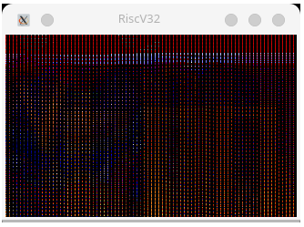
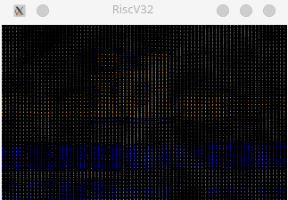

## KUTEmu

WIP: Trying to build a toy RiscV 32bit emulator for running Doom

The implementation can run Doom, but it is very slow at ~1 frame per minute.
The implementation can be optimized further.

## TODO:
* Combine all CSR registers which are shared.
* Fix ecall instruction
* Implement framebuffer driver
* Implement Supervisor mode

## Others
Based on current execution privilege level, always adjust mstatus register. For example, all lower priv mode interrupts 
should be disabled and all higher mode interrupts enabled.

## How To Run Emulator

Go to `/Projects/RiscV/`
This will run devenv and enter nix shell. Now start Goland there and simply press run button.

## Useful Resources
* https://chromiteh-soc.readthedocs.io/en/latest/clint.html
* https://five-embeddev.com/baremetal/timer/
* https://luplab.gitlab.io/rvcodecjs/
* https://five-embeddev.com/riscv-priv-isa-manual/Priv-v1.12/machine.html#machine-interrupt-registers-mip-and-mie
* https://sifive.cdn.prismic.io/sifive%2Fc89f6e5a-cf9e-44c3-a3db-04420702dcc1_sifive+e31+manual+v19.08.pdf
* 